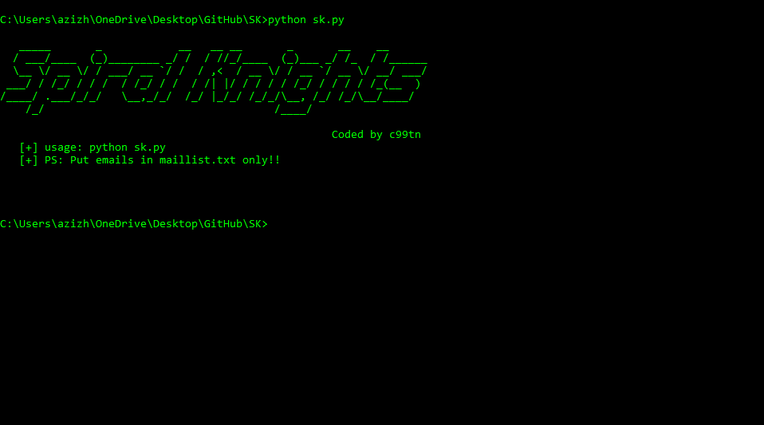
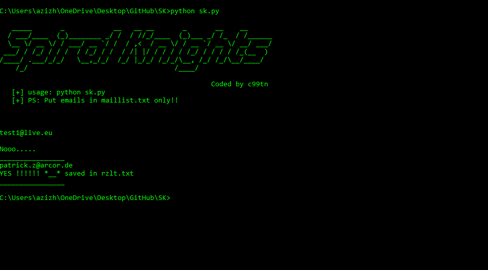
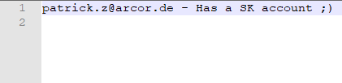

# Spiral-Knights-Email-Checker

Intro:
Check email lists for linked spiral knights accounts!
tip: use it with maillacess lists then reset password :O

Installation:
$ git clone https://github.com/c99tn/Spiral-Knights-Email-Checker
$ cd Spiral-Knights-Email-Checker
$ unzip SK.zip

Requirements:
Python 3
$ pip install mechanize

Usage: 

python sk.py

Important: 
Checker will start to check and will save the hits in rzlt.txt file!
Do not change maillist.txt file name or use another text file to store emails; copy and paste your emails in hte maillist.txt only!

Thats all .
  

